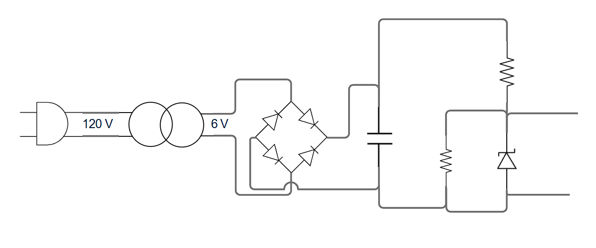
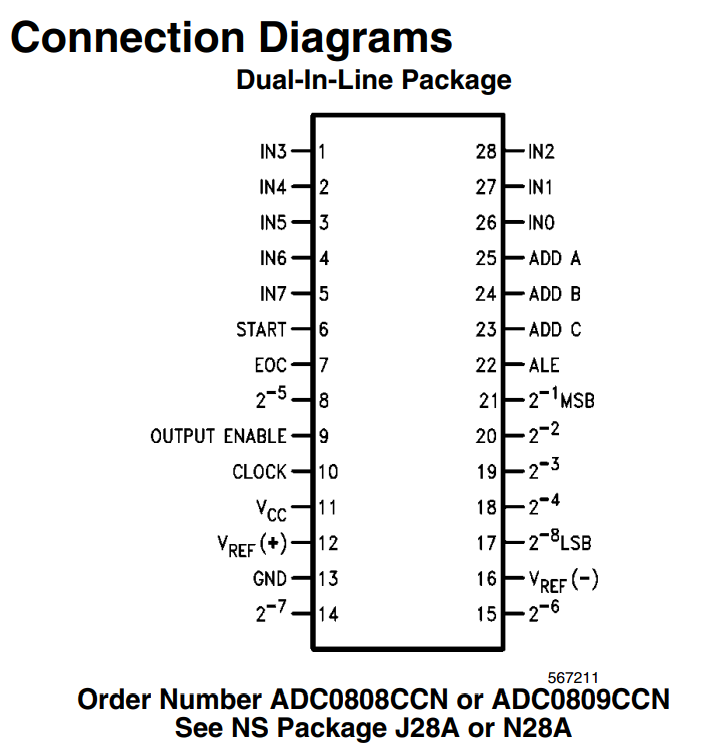

# Lab-3-Digital_1
## Introducción
En este laboratorio, mediante una FPGA, se intentó modelar un voltímetro. Este a su vez consistía en una parte más analógica donde un transformador de 20:1 pasaba la tensión de 120V a 6V; después se rectificaba la señal, luego un diodo Zener para regular el voltaje y de ahí al conversor analógico digital ADC0808. Esto nos permitirá volver la señal digital y, al procesarla en el embebido, visualizar la tensión en voltios.

Por otra parte, es importante resaltar que el apartado digital se trabajó y comprendió; sin embargo, físicamente fue difícil su implementación debido a unas fallas, pero se abordará como se realizó el intento, lo que se buscaba finalmente y los impedimentos que se tuvieron.

## Desafío

Este laboratorio contiene, como se dijo anteriormente, un componente físico importante. Se debe partir sabiendo que a Colombia llega una tensión directa a la pared de 110 V, pero por variaciones y protección se escogió un transformador 20:1; así, si tomábamos dicho voltaje como 120 V, pasaría a 6 V.

Una vez que se ha reducido este voltaje, se busca pasar por un puente de diodos o rectificador la señal. Quedando DC se conecta a un par de resistencias, para de este modo tener un divisor de voltaje y regularlo con ayuda del Zener, de ahí se conectaba al módulo ADC0808, para que por cada Data Bus salieran 1 bit, siendo en total 8, esto en un rango de 0 a 255, para que al lograr medir la tensión y pasando a código binario a BCD indique los voltios.

**Rectificación**

El voltaje, teóricamente como se dijo, se reducirá a 6 V RMS, quedan en unos 8,48Vp. Al pasar por el puente de diodos, se pasará por un condensador para suavizado de la señal y el voltaje presente que llegará a las resistencias es de 7,08.

**Divisor de Tensión**

Como se menciona, se plantea un divisor de tensión sencillo entre dos resistencias. Si se usa un trimmer de 100 K ohms en la resistencia dos, que debe ser la de caída, donde la tensión debe ser de 3,3 V, se debe situar en  46,610 K Ohms, para conectarse al conversor ADC, dejando este circuito.

**ADC 0808**

Este lo vamos a energizar con 5 voltios, fijando así también nuestra referencia, para poder iniciar la conversión y finalizarla. Se pone en corto START con EOC (End Of Conversion), energizamos también OE y ALE, para habilitar la entrega de datos digitales y almacenar la dirección respectivamente. De los pines 23-25 salen los selectores A-B-C, del menos al más significativo. Este selector va a los 3.3, las salidas análogas irán a los 5 V y las digitales a la FPGA y los 3 módulos de 7 segmentos.

